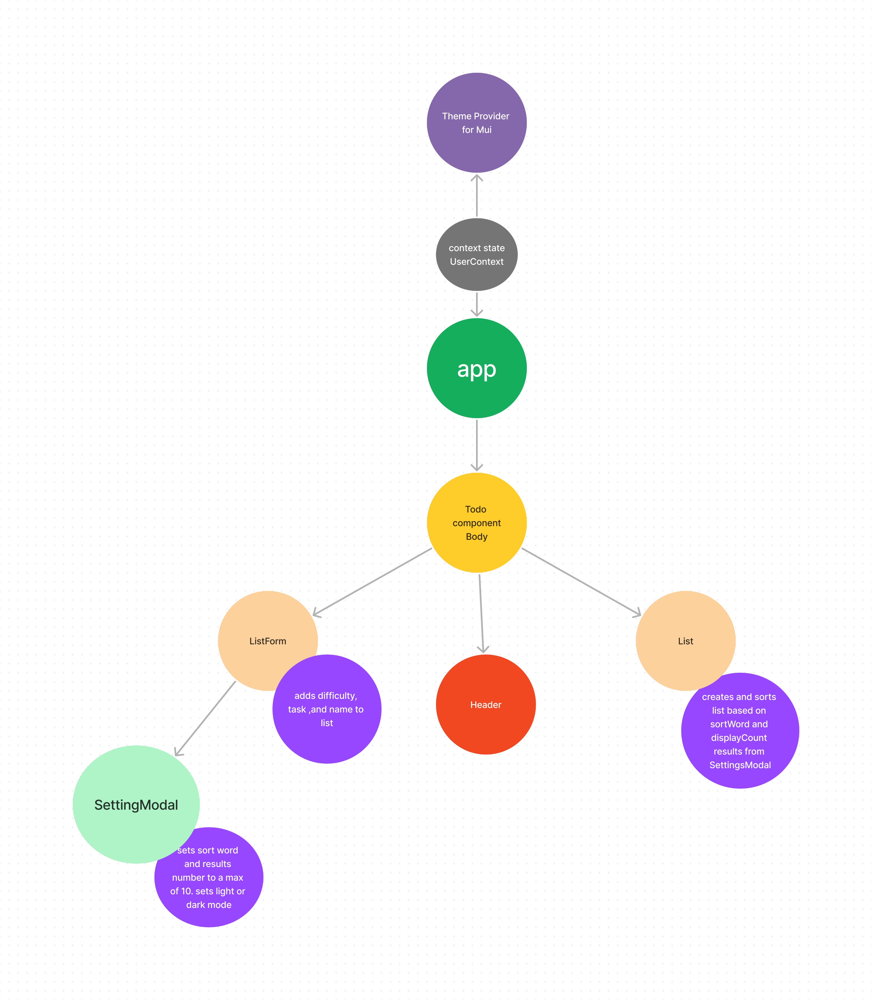

# toDo app

# LAB - 32

## Deployment Test

### Author: John Cokos

- [tests report](https://github.com/codefellows/code-401-javascript-example-lab/actions)
- [front-end](https://code-401-js-lab-example.herokuapp.com/status)

### Setup

#### `.env` requirements

- `PORT` - 5173

#### Running the app

- `npm run dev`
- Endpoint:

  - Returns array of Objects

    ```javascript
    [
      {
        difficulty: 3,
        text: "Complete Homework",
        assignee: "John",
        id: "1",
        complete: false,
      }
    ];
    ```

#### Tests

- Unit Tests: `npm run test`
- Lint Tests: `npm run lint`

#### UML

(Created with [figjam](https://www.figma.com/jam))


